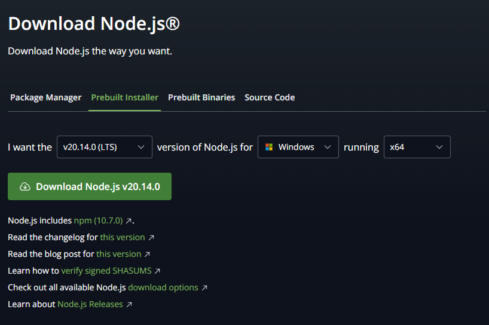
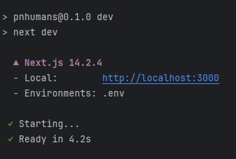

# Documentação PNHUMANS v0.1.0

## Status = descontinuado


# Guia de instalação

Para iniciar o processo de instalação você deve ter instalado no seu computador ou servidor o **Nodejs 20.14**

## Instalar Nodejs no windows

### Download Nodejs

link para download: [https://nodejs.org/en/download/prebuilt-installer](https://nodejs.org/en/download/prebuilt-installer)

- Escolha a versão 20.14 do Nodejs
- Escolha seu sistema operacional
- Escolha a versão do seu sistema
- Clique em **Download Node.js v20.14.**



## Instalar Nodejs no Linux

Baseados em Debian/Ubuntu

no terminal

```bash
curl -o- https://raw.githubusercontent.com/nvm-sh/nvm/v0.39.7/install.sh | bash
nvm install 20
```

Feche o terminal caso esteja usando linux no modo interface(**Desktop**), caso esteja usando somente no modo terminal(**server**) reinicie a maquina.

Agora teste se a instalação deu certo.

```bash
node -v 
```

## Configurando Variáveis de Ambiente

crie um arquivo na raiz do protejo chamando **.env** dentro do arquivo coloque a seguinte configuração.

```
PN_HUMANS_API_ADDRESS = "http://localhost:4700"
```

Essa é a chave onde você ira colocar o endereço da sua api interna onde serão manipulado os usuario e os huamnos salvos


```
RANDON_HUMANS_API_ADDRESS = "https://randomuser.me/api/?nat=br"
```

Essa é a chave onde você ira colocar o endereço da api onde a aplicação ira pegar os humanos.


Após essa configuração a aplicação está pronta para ser inicializada

## Inicializando a aplicação

Para inicializar a aplicação digite o seguinte comando no terminal

```bash
npm run deploy
```

se ocorrer tudo bem




